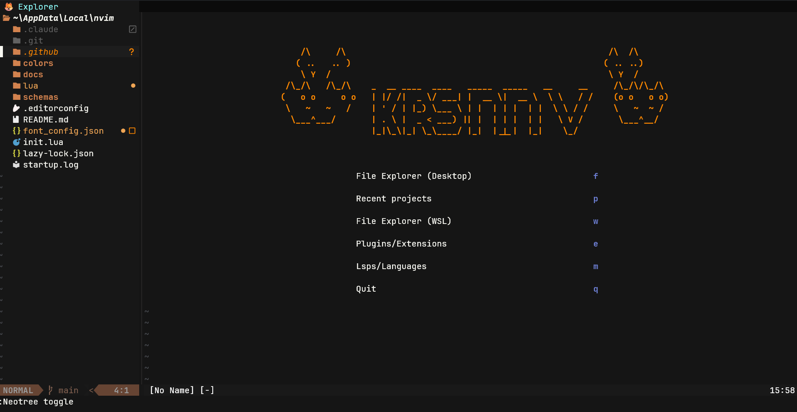
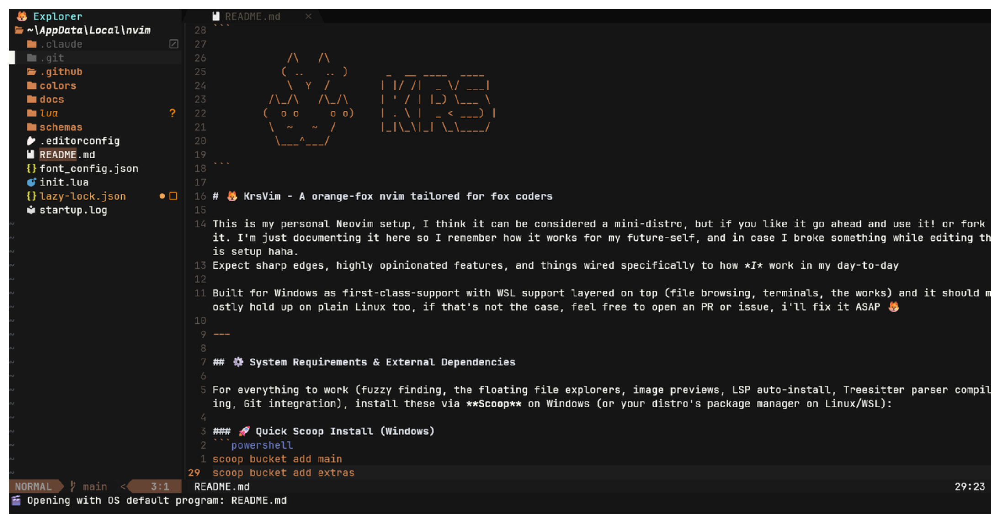

```

            /\   /\
           ( ..   .. )      _  __ ____  ____
            \  Y  /        | |/ /|  _ \/ ___|
         /\_/\   /\_/\     | ' / | |_) \___ \
        (  o o     o o)    | . \ |  _ < ___) |
         \  ~   ~  /       |_|\_\|_| \_\____/
          \___^___/

```

# 🦊 KrsVim - A orange-fox nvim tailored for fox coders





This is my personal Neovim setup, I think it can be considered a mini-distro, but if you like it go ahead and use it! or fork it. I'm just documenting it here so I remember how it works for my future-self, and in case I broke something while editing this setup haha.
Expect sharp edges, highly opinionated features, and things wired specifically to how *I* work in my day-to-day

Built for Windows as first-class-support with WSL support layered on top (file browsing, terminals, the works) and it should mostly hold up on plain Linux too, if that's not the case, feel free to open an PR or issue, i'll fix it ASAP 🦊

---

## ⚙️ System Requirements & External Dependencies

For everything to work (fuzzy finding, the floating file explorers, image previews, LSP auto-install, Treesitter parser compiling, Git integration), install these via **Scoop** on Windows (or your distro's package manager on Linux/WSL):

### 🚀 Quick Scoop Install (Windows)
```powershell
scoop bucket add main
scoop bucket add extras
scoop install neovim git ripgrep fd chafa gcc nodejs-lts go dotnet-sdk
```

### 📋 Dependency Breakdown

| Tool / CLI | Purpose in Config | Scoop Command (Windows) | Linux / WSL Package |
|---|---|---|---|
| **Neovim** (>= 0.10) | Core editor | `scoop install neovim` | `neovim` |
| **Git** | Mason, Neogit, Lazy plugin manager | `scoop install git` | `git` |
| **ripgrep** (`rg`) | Telescope live grep (`<C-f>`) | `scoop install ripgrep` | `ripgrep` |
| **fd** | Faster file finding for Telescope | `scoop install fd` | `fd-find` / `fd` |
| **chafa** | Terminal image previewer (`<leader>i`) | `scoop install chafa` | `chafa` |
| **GCC / MinGW** | Compiling Treesitter parsers | `scoop install gcc` | `gcc` / `build-essential` |
| **Node.js & npm** | JS/TS LSP (`ts_ls`), JSON/HTML/CSS LSPs, Prettier | `scoop install nodejs-lts` | `nodejs npm` |
| **Go** | `gopls`, `gofumpt`, `goimports` | `scoop install go` | `golang` |
| **.NET SDK** (`dotnet`) | C# LSP (`omnisharp`), Nuget package manager | `scoop install dotnet-sdk` | `dotnet-sdk` |
| **WSL** *(optional, Windows only)* | WSL file explorer & auto-WSL terminals | `wsl --install` | — |

---

## 🛠️ Languages, LSP, Formatters & Parsers (Mason & Treesitter)

Mason, Conform and Treesitter are preconfigured to install and manage everything below automatically — no manual `:MasonInstall` needed.

| Language / Environment | LSP Server | Formatters (Conform) | Treesitter Parser |
|---|---|---|---|
| **Lua** | `lua_ls` | `stylua` | `lua` |
| **JSON** | `jsonls` *(SchemaStore auto)* | `prettierd` / `prettier` | `json` |
| **JavaScript / TS / React** | `ts_ls` | `prettierd` / `prettier` | `javascript`, `typescript`, `tsx` |
| **HTML / CSS** | `cssls` / `html` | `prettierd` / `prettier` | `html`, `css` |
| **Svelte / Astro** | `svelte`, `astro` | `prettierd` / `prettier` | `svelte`, `astro` |
| **Go** | `gopls` | `gofumpt`, `goimports` | `go`, `gomod`, `gowork`, `gosum` |
| **C# / .csproj** | `omnisharp` (`.cs`), `lemminx` (`.csproj`, `.props`, `.targets` — treated as XML) | — | `c_sharp` |
| **YAML / TOML** | `yamlls`, `taplo` | — | `yaml`, `toml` |
| **Markdown** | — | — | `markdown`, `markdown_inline` |
| **Config / Data** | — | — | `vim`, `vimdoc` |

- **JSON Schema Validation** via `schemastore.nvim` — autocompletion and live validation in `package.json`, `tsconfig.json`, `.eslintrc`, etc.
- **Format on Save** via `conform.nvim` (`timeout_ms = 1000`, `lsp_fallback = true`).
- **C# IntelliSense** comes from `omnisharp` reading the project's `.csproj`/`.sln`; you don't need to open the solution manually, it resolves from the working directory.

#### ➕ Adding a new Treesitter language

`lua/plugins/lsp/treesitter.lua` pins `nvim-treesitter` to the `main` branch (the rewrite), which dropped the old `highlight.enable` config — highlighting is started per-buffer via a `FileType` autocmd that calls `vim.treesitter.start()` on any filetype, `pcall`'d so it silently no-ops when there's no parser installed. To add a language:

1. Add the parser name to the `parsers` list at the top of `lua/plugins/lsp/treesitter.lua`.
2. `:TSUpdate` (or restart Neovim — `ts.install(parsers)` runs on setup).

No autocmd/pattern changes needed — it already matches every filetype.

---

## 📦 Installed Plugins & Custom Modules

### 🛠️ Custom-Tailored Plugins & Modules (`lua/plugins/krs`, `lua/config/krs`)

| Feature | Location | What it does | Keybindings |
|---|---|---|---|
| **Workspaces Manager** | `lua/plugins/krs/workspaces.lua` | Harpoon + Telescope hybrid session manager. Saves buffers, tab layout and `cwd` per project into numbered slots; rename, overwrite, delete from a floating UI. | `<C-S-w>`, `<leader>ws`, `<leader>ww`, `<leader>wm`, `<leader>w1`..`9`, `<C-S-m>` |
| **Command Palette** | `lua/plugins/krs/command_palette.lua` | VSCode-style `Ctrl+Shift+P` fuzzy command list — runs Vim commands, simulated keypresses, or Lua functions from one picker. | `<C-S-p>` |
| **Git Control Center** | `lua/plugins/krs/git_center.lua` | Custom floating Git UI: stage/unstage, diff preview, commit form (title/description/tag), stash, and undo — no external Git plugin needed for the daily flow. | `<C-S-g>` |
| **Nuget Package Manager** | `lua/plugins/krs/nuget.lua` | CRUD for `<PackageReference>` in a `.csproj` via `dotnet add/remove package`, through a Telescope picker. Only activates when the project actually has a `.csproj`. | `<leader>ng`, `:NugetManager` |
| **Desktop File Explorer** | `lua/config/krs/file_explorer.lua` | Pure-Lua floating file browser (no external file-manager binary), starts at `~/Desktop`. Create/rename/delete files & folders, drill in/out, set a folder as the active project. | `<C-S-f>` |
| **WSL File Explorer** | `lua/config/krs/file_explorer.lua` | Same explorer, rooted at a WSL distro's filesystem (`\\wsl.localhost\<Distro>\`). Lists installed distros if there's more than one. Windows-only. | `<leader>fw`, `:TelescopeFileBrowserWSL` |
| **Open Folder Picker** | `lua/plugins/editor/telescope.lua` | Generic "open any folder as project" picker, independent of the Desktop explorer. | `<C-S-o>` |
| **Recent Projects** | `lua/plugins/editor/project.lua` | `project.nvim` wrapped in a custom picker with favorites (pinned to the bottom) and per-entry delete. | `<C-S-r>` |
| **Multi-Terminal Manager** | `lua/config/krs/terminal.lua` | 9 lazily-spawned terminals, toggle/select independently. If the terminal's `cwd` sits inside a WSL distro path, it launches `wsl.exe` there instead of the default Windows shell — automatic, no config needed. | `<A-1>`..`<A-9>`, `<C-;>` |
| **Task & Script Manager** | `lua/config/krs/tasks.lua` | Per-project tasks stored in `.nvimkrs`; run, chain, or set a default task detected from `Makefile`/`package.json`/etc. | `<C-S-t>`, `<leader>ta`, `<C-S-a>` |
| **Live Colorscheme Previewer** | `lua/config/krs/colorscheme_preview.lua` | Previews the theme live as you tab through `:colorscheme <Tab>`, reverts if you cancel. | `:colorscheme <Tab>` |
| **Pixel-Art Image Viewer** | `lua/config/krs/image_viewer.lua` | Renders images as terminal pixel art via `chafa` in a floating window; can also hand off to the OS default app. | `<leader>i`, `<C-S-Enter>` |
| **Buffer Cleaner & Smart Quit** | `lua/config/krs/buffer_cleaner.lua` | Makes `:q` context-aware (close split → close tab → back to dashboard → quit), and sweeps empty `[No Name]` buffers automatically. | `:q` / `:q!` |
| **Context Help** | `lua/config/krs/context_help.lua` | `?` / `<F1>` shows a tiny, context-aware cheatsheet (different content in Neo-tree, Git, Telescope, editor). | `?`, `<F1>` |

### Core & LSP
| Plugin | Purpose |
|---|---|
| `neovim/nvim-lspconfig` | Native LSP server configuration |
| `williamboman/mason.nvim` | Package manager for LSPs, formatters & linters |
| `williamboman/mason-lspconfig.nvim` | Mason integration with nvim-lspconfig |
| `zapling/mason-conform.nvim` | Automatic installer for Conform formatters |
| `saghen/blink.cmp` | Fast completion engine (modern nvim-cmp replacement) |
| `rafamadriz/friendly-snippets` | Multi-language snippet collection |
| `stevearc/conform.nvim` | Fast asynchronous code formatter |
| `nvim-treesitter/nvim-treesitter` | Code highlighting and AST parsing |
| `b0o/schemastore.nvim` | JSON schemas for popular config files |

### Editor & Navigation
| Plugin | Purpose |
|---|---|
| `ThePrimeagen/harpoon` (v2) | Fast file bookmarking and navigation |
| `nvim-telescope/telescope.nvim` | Fuzzy finder |
| `nvim-tree/neo-tree.nvim` | Sidebar file explorer |
| `NeogitOrg/neogit` | Git interface sidebar |
| `sindrets/diffview.nvim` | Diff viewer and history for Neogit |
| `ahmedkhalf/project.nvim` | Project history backing the Recent Projects picker |
| `voldikss/package-info.nvim` | Inline `package.json` dependency management |
| `nvim-lua/plenary.nvim` | Lua utility library |

### Interface & Theme
| Plugin | Purpose |
|---|---|
| `goolord/alpha-nvim` | ASCII start dashboard |
| `doki-theme/doki-theme-vim` | Visual theme (Doki Theme) with a custom `#1e1e1e` background |
| `akinsho/bufferline.nvim` | Top buffer tab bar |
| `nvim-lualine/lualine.nvim` | Statusline |
| `nvim-highlight-colors` | Inline CSS color preview (hex, rgb, hsl) |
| `nvim-window-picker` | Visual window selector when opening files |
| `nvim-file-operations` | Auto rename/move sync between disk and buffers |

---

## ⌨️ Keyboard Shortcuts

> **Leader key**: `<Space>`

### 📂 Workspaces (Session & UI Management)
*A hybrid between Harpoon and a project/session selector.*

| Shortcut / Command | Mode | Description |
|---|---|---|
| `<C-S-w>` / `<C-S-W>` | n, i, v, t | Open Workspaces picker (Telescope floating UI) |
| `<C-S-m>` | n, i, v, t | Close session & return to Main Menu (with save prompt) |
| `<leader>ww` | n | Open Workspaces picker |
| `<leader>ws` | n | Save current UI state as a workspace (optional name) |
| `<leader>wm` | n | Close session & return to Main Menu (Dashboard) |
| `<leader>w1` .. `<leader>w9` | n | Load workspace from slot 1 to 9 directly |
| `:WorkspaceSave [name]` | Cmd | Save workspace with a name |
| `:WorkspaceLoad [name/slot]` | Cmd | Load a workspace by name or slot number |
| `:WorkspaceClose` / `:WorkspaceMenu` | Cmd | Prompt to save and return to main menu |
| `:WorkspaceDelete [name]` | Cmd | Delete a saved workspace |
| `:WorkspaceRename [old] [new]` | Cmd | Rename a workspace |
| `:Workspaces` / `:WorkspaceSelect` | Cmd | Open Workspaces selector UI |

> **Inside the Workspaces picker (`<C-S-w>`)**:
> - `<Enter>`: load selected workspace.
> - `a` / `<C-a>`: save current session as a **new** workspace.
> - `s` / `<C-s>`: **overwrite** selected workspace with current state.
> - `d` / `<C-d>` / `<Del>`: **delete** workspace.
> - `r` / `<C-r>` / `<F2>`: **rename** workspace.
> - `g` / `<C-g>`: toggle current-project vs all-projects filter.
> - `1`..`9`: jump directly to slot.

---

### 💻 General & File Editing

| Shortcut | Mode | Action |
|---|---|---|
| `<C-s>` | n, v, i | Save current file (`:w`) |
| `<C-+>` / `<C-=>` | n, i, v, t | Increase font size (`+1pt`, persisted) |
| `<C-->` | n, i, v, t | Decrease font size (`-1pt`, persisted) |
| `<C-0>` | n, i, v, t | Reset font size to default (`14pt`) |
| `<leader>f` | n, v | Format file or selection (LSP / Conform) |
| `<F2>` | n | Rename file on disk (or item inside Neo-tree) |
| `<C-w>` | n | Close current buffer (VSCode tab-close style) |
| `<C-_>` | n, v | Comment line (`gcc`) or selection (`gc`) |
| `<C-c>` | v | Copy selection to system clipboard (`"+y`) |
| `<leader>i` | n | View image as pixel art in a floating window (`chafa`) |
| `<C-S-Enter>` | n | Open image/video with the OS default app |
| `<leader>cd` | n | Open default netrw directory browser |
| `:ReloadConfig` | Cmd | Reload Neovim configuration instantly |

---

### 🪟 Windows & Navigation

| Shortcut | Mode | Action |
|---|---|---|
| `<C-h>` | n | Move focus to left window |
| `<C-l>` | n | Move focus to right window |
| `<C-S-j>` | n | Move focus to bottom window |
| `<C-S-k>` | n | Move focus to top window |
| `<C-Right>` | n | Make window narrower |
| `<C-Left>` | n | Make window wider |
| `<C-Up>` | n | Make window taller |
| `<C-Down>` | n | Make window shorter |

---

### 🩺 Diagnostics & LSP

| Shortcut | Mode | Action |
|---|---|---|
| `<A-k>` / `<M-k>` | n, v | Go to definition of symbol under cursor |
| `<C-j>` | n, i, v | Show parameter signature help |
| `<C-o>` | n | Jump back in the Vim jump list |
| `<leader>k` | n | Show diagnostic detail floating under cursor |
| `<leader>u` | n | Jump to previous diagnostic |
| `<leader>o` | n | Jump to next diagnostic |

### 🐞 Debugging (DAP)

| Shortcut | Mode | Action |
|---|---|---|
| `<A-j>` / `<M-j>` | n, i, v | Toggle breakpoint on current line |
| `<C-S-s>` | n, i, v | Start / continue debugging (opens DAP-UI) |
| `<C-S-x>` | n, i, v | Terminate debugger and close UI |

---

### 🛠️ Per-Project Task & Script Manager

| Shortcut | Mode | Action |
|---|---|---|
| `<C-S-t>` / `<leader>ta` | n, i, v | Open Task Menu UI (select, run, set default `[d]`, add `[a]`, delete `[x]`) |
| `<C-S-a>` | n, i, v | Run the project's default task (auto-detected `cwd = project_root`) |
| `<C-1>` .. `<C-4>` | n, i, v, t | Toggle output window for background task slot 1-4 (no-op if slot empty) |
| `` <C-`> `` | n, i, v, t | Toggle output window for the last-run/focused task slot |

> Up to 4 tasks can run in the background at once (e.g. multiple `bun run dev`); each gets its own slot, closing the window doesn't kill the job.


---

### 💻 Integrated Terminal (Lazy-Loaded, 1-9)

| Shortcut | Mode | Action |
|---|---|---|
| `<A-1>` .. `<A-9>` | n, i, t | Select & switch to terminal #1-#9 (spawned on first use) |
| `<C-;>` | n, i, t | Toggle the currently selected terminal (open/hide bottom panel) |
| `<C-w>c` | n (in terminal) | Close active terminal window |
| `<C-w>` | t | Standard window navigation from terminal mode |

> If the terminal's working directory is inside a WSL distro's filesystem (opened via the WSL File Explorer, for example), it opens `wsl.exe -d <Distro> --cd <path>` instead of the default Windows shell — no extra setup.

---

### 🐧 WSL File Explorer

| Shortcut / Command | Mode | Action |
|---|---|---|
| `<leader>fw` / `:TelescopeFileBrowserWSL` | n, i, v | Browse a WSL distro's filesystem via `\\wsl.localhost\<Distro>\`. Prompts for a distro if more than one is installed. Windows-only. |

Opening a folder from here as the active project (`o`) drops it straight into Recent Projects like any other folder — and any terminal opened from that project auto-switches to WSL.

---

### 📦 Nuget Package Manager (C# projects only)

| Shortcut / Command | Mode | Action |
|---|---|---|
| `<leader>ng` / `:NugetManager` | n | Open the package picker for the `.csproj` in the current project |

> Only does anything if the current project actually has a `.csproj`; otherwise it just tells you so.
> Inside the picker: `a` add package, `u` update selected package, `d` remove selected package. All three shell out to `dotnet` so the `.csproj` stays correctly formatted.

---

### 🔍 Telescope (Fuzzy Finder & Projects)

| Shortcut | Mode | Action |
|---|---|---|
| `<C-k>` | n, i | Find files respecting `.gitignore` |
| `<C-A-k>` | n, i | Find files ignoring `.gitignore` |
| `<C-f>` | n, i | Live global text search (`live_grep`) |
| `<C-S-o>` | n, i | Open any folder as a project |
| `<C-S-f>` | n, i, v | Floating Desktop file explorer |
| `<C-S-r>` | n | Recent projects list (favorites, delete) |
| `<leader>fh` | n | Search help tags |

> **Inside Recent Projects (`<C-S-r>`)**: `<C-f>` toggles favorite (pins to bottom), `<C-r>` removes from history.

---

### 🌴 Neo-tree (File Explorer)

| Shortcut | Mode | Action |
|---|---|---|
| `<leader>e` / `:Neotree toggle` | n | Toggle sidebar file explorer |
| `a` | Neo-tree | Create new file or directory (end with `/` for a folder) |
| `d` | Neo-tree | Delete file/folder |
| `r` | Neo-tree | Rename item |
| `c` | Neo-tree | Copy item |
| `m` | Neo-tree | Move item |

---

### 🐙 Git Control Center

| Shortcut | Mode | Action |
|---|---|---|
| `<C-S-g>` / `<C-S-G>` | n, i, v, t | Toggle the Git Control Center (stage, diff, commit, stash) |
| `s` / `S` | n, v (Git Center) | Stage selected / stage all |
| `u` / `U` | n, v (Git Center) | Unstage selected / unstage all |
| `c` | Git Center | Open commit form (title / description / tag) |
| `d` | Git Center | Discard changes on selected file |
| `r` | Git Center | Refresh |
| `<Esc>` / `<CR>` (commit form) | Git Center | Save & close commit form |

### 🌿 Neogit & Diffview (secondary Git UI)

| Shortcut | Mode | Action |
|---|---|---|
| `<Enter>` | Neogit Status | Open diff in vertical split |
| `d` | Neogit Status | Quick diff preview |

---

### 🚀 Command Palette

| Shortcut / Command | Mode | Action |
|---|---|---|
| `<C-S-p>` / `<C-S-P>` / `:CommandPalette` | n, i, v, t | Fuzzy-search every registered command, keymap, and action from one picker |

---

### 📑 Bufferline (Buffer Tabs)

| Shortcut | Mode | Action |
|---|---|---|
| `gt` / `<A-l>` / `<A-Right>` | n | Jump to next buffer |
| `gT` / `<A-h>` / `<A-Left>` | n | Jump to previous buffer |
| `<C-A-Left>` | n | Move current tab left |
| `<C-A-Right>` | n | Move current tab right |

---

### 📦 package-info (npm / pnpm / bun dependencies)

| Shortcut | Mode | Action |
|---|---|---|
| `<leader>ns` | n | Show inline package versions in `package.json` |
| `<leader>nc` | n | Hide inline package versions |
| `<leader>nu` | n | Update package under cursor |
| `<leader>nd` | n | Delete package under cursor |
| `<leader>ni` | n | Install new package |
| `<leader>np` | n | Change package version |

---

### ⚡ Autocompletion (Blink.cmp)

| Shortcut | Mode | Action |
|---|---|---|
| `<CR>` | Insert | Accept highlighted completion item |
| `<C-space>` / `<C-@>` | Insert | Trigger completion menu / documentation |
