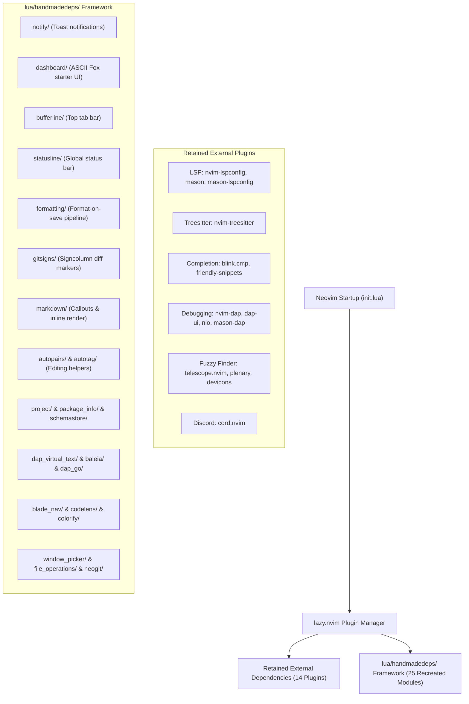

# 📑 Implementation Plan: Local Handmade Dependencies (`handmadedeps`) Refactor

## 🎯 Goal & Architecture Overview
This refactor eliminates ~25 non-essential external plugins and replaces them with a zero-dependency, pure Lua framework located under `lua/handmadedeps/`.

All work will be executed exclusively on a new git branch named `dependency-refactor`.



---

## 📋 Comprehensive Plugin Index

### 1. Retained External Dependencies (14 Plugins)
These core engine plugins and `cord.nvim` will be **kept as external dependencies**:

| Plugin Name | Category | Purpose |
| :--- | :--- | :--- |
| `neovim/nvim-lspconfig` | LSP Engine | Language server configurations & client lifecycle |
| `williamboman/mason.nvim` | Binary Manager | Cross-platform binary downloader for LSP/DAP/Formatters |
| `williamboman/mason-lspconfig.nvim` | LSP Bridge | Automatic server installer & bridge for Mason |
| `nvim-treesitter/nvim-treesitter` | Treesitter Engine | Syntax tree parser compilation & query engine |
| `saghen/blink.cmp` | Autocompletion | High-performance completion engine with fuzzy matching |
| `rafamadriz/friendly-snippets` | Snippets | Snippet collection for blink.cmp |
| `mfussenegger/nvim-dap` | DAP Engine | Debug Adapter Protocol client core |
| `rcarriga/nvim-dap-ui` | DAP UI | Interactive debugger layout & variable inspector |
| `nvim-neotest/nvim-nio` | Async I/O | Async I/O library required by `nvim-dap-ui` |
| `jay-babu/mason-nvim-dap.nvim` | DAP Bridge | Mason installer bridge for debug adapters |
| `nvim-telescope/telescope.nvim` | Fuzzy Finder | Interactive picker engine |
| `nvim-lua/plenary.nvim` | Utility Core | Lua async/path utilities required by Telescope |
| `nvim-tree/nvim-web-devicons` | UI Icons | Filetype icon provider for Telescope & Neo-tree |
| **`vyfor/cord.nvim`** | Discord Presence | **Discord Rich Presence Integration (Kept per request)** |

---

## 2. Candidate Plugins Recreated Locally (25 Plugins ➜ `lua/handmadedeps/`)
These external plugins will be **removed from `lazy.nvim`** and replaced with pure local Lua modules inside `lua/handmadedeps/`:

| External Plugin Removed | Handmade Local Replacement Path | Functionality & Features Recreated |
| :--- | :--- | :--- |
| `rcarriga/nvim-notify` | `lua/handmadedeps/notify.lua` | Floating toasts with slide animation, copy on click, focus protection |
| `goolord/alpha-nvim` | `lua/handmadedeps/dashboard.lua` | Responsive ASCII Fox header, action buttons, environment label |
| `akinsho/bufferline.nvim` | `lua/handmadedeps/bufferline.lua` | Custom `tabline` renderer, deleted file `[D]` tags, tab cycle/reorder keymaps |
| `nvim-lualine/lualine.nvim` | `lua/handmadedeps/statusline.lua` | Global statusline (`laststatus=3`) integrated with `statusline_picker.lua` |
| `brenoprata10/nvim-highlight-colors` | `lua/handmadedeps/colorify.lua` | Real-time `#hex`, `rgb()`, `hsl()` extmark background color highlights |
| `lewis6991/gitsigns.nvim` | `lua/handmadedeps/gitsigns.lua` | Signcolumn diff markers (`▎`, ``), async git diff watcher, `]c`/`[c` navigation |
| `MeanderingProgrammer/render-markdown.nvim` | `lua/handmadedeps/markdown/init.lua` | Markdown callout boxes (`[!NOTE]`, `[!TIP]`), table borders, concealed headers |
| `iamcco/markdown-preview.nvim` | `lua/handmadedeps/markdown/browser.lua` | Web browser launcher for previewing `.md` files natively |
| `ahmedkhalf/project.nvim` | `lua/handmadedeps/project.lua` | Native `vim.fs.root()` pattern detector & history manager for project picker |
| `vuki656/package-info.nvim` | `lua/handmadedeps/package_info.lua` | `package.json` dependency parser with manual status command & virtual text |
| `stevearc/conform.nvim` | `lua/handmadedeps/formatting.lua` | Format-on-save runner for Pint, Prettier, Stylua, Gofumpt, Beautysh, CSharpier |
| `zapling/mason-conform.nvim` | `lua/handmadedeps/formatting.lua` | Formatter executable path resolver for Mason packages |
| `windwp/nvim-autopairs` | `lua/handmadedeps/autopairs.lua` | Pair auto-insertion (`()`, `{}`, `[]`, `""`, `''`) on `InsertCharPre` |
| `windwp/nvim-ts-autotag` | `lua/handmadedeps/autotag.lua` | HTML/JSX closing tag auto-insertion on `>` keypress |
| `theHamsta/nvim-dap-virtual-text` | `lua/handmadedeps/dap_virtual_text.lua` | Inline variable value extmark virtual text on DAP stopped event |
| `m00qek/baleia.nvim` | `lua/handmadedeps/baleia.lua` | ANSI escape code color stripper & highlighter for DAP REPL console |
| `leoluz/nvim-dap-go` | `lua/handmadedeps/dap_go.lua` | Delve DAP adapter & configuration generator for Go files |
| `ricardoramirezr/blade-nav.nvim` | `lua/handmadedeps/blade_nav.lua` | Laravel Blade component navigation & blink.cmp completion provider |
| `jwalton512/vim-blade` | `lua/handmadedeps/blade_nav.lua` | Laravel Blade syntax highlighting & directive matcher |
| `NeogitOrg/neogit` | `lua/handmadedeps/neogit.lua` | `:Neogit` user command router directly to custom Git Center (`:GitCenterToggle`) |
| `sindrets/diffview.nvim` | `lua/handmadedeps/neogit.lua` | Diffview router to custom Git Center full-screen diff modal |
| `b0o/schemastore.nvim` | `lua/handmadedeps/schemastore.lua` | Schema catalog using bundled JSON & TOML schemas under `schemas/` |
| `Wansmer/symbol-usage.nvim` | `lua/handmadedeps/codelens.lua` | Reference counter ("󰌹 X references") using native LSP CodeLens |
| `s1n7ax/nvim-window-picker` | `lua/handmadedeps/window_picker.lua` | Target window selection modal for Neo-tree file openings |
| `antosha417/nvim-lsp-file-operations` | `lua/handmadedeps/file_operations.lua` | LSP `workspace/willRenameFiles` handler for file move/rename events |

---

## ⚠️ User Review Required

> [!IMPORTANT]
> **Git Branch Isolation**:
> All commits will be made strictly on the `dependency-refactor-v2` branch. The `main` branch will remain untouched.

> [!NOTE]
> **Zero Visual or Behavioral Regression**:
> Every UI component (dashboard ASCII fox, bufferline tabs, statusline, toast notifications, gitsigns, markdown callouts, DAP virtual text, formatting on save, etc.) and command/keybinding will look and behave **identically** to the existing setup.

---

## 🛠️ Proposed Changes

### Branch Setup
- Run `git checkout -b dependency-refactor` to branch off current `main`.

### Directory Architecture
- Create directory structure under `lua/handmadedeps/`.

### Specification Files Update
- Update plugin specs in `lua/plugins/ui/`, `lua/plugins/editor/`, `lua/plugins/lsp/` to point `config`/`dir` to their local `handmadedeps` module.
- Retain `lua/plugins/miscelanea/discord.lua` (`cord.nvim`) untouched.

---

## 🧪 Verification Plan

### Automated Tests
1. Execute the full Neovim unit test suite after each component is added:
   ```powershell
   nvim -l tests/run.lua
   ```
2. Verify all **402+ tests pass with 0 failures**.

### Manual Verification
1. **Git Branch Verification**: Confirm `git branch` displays `dependency-refactor`.
2. **Dashboard & UI**: Open Neovim without arguments (`nvim`), verify ASCII Fox banner, menu buttons (`f`, `p`, `s`, `w`, `e`, `m`, `q`), and environment label match exact original layout.
3. **Bufferline & Tabs**: Open multiple files, cycle tabs (`gt`, `gT`), reorder tabs (`<A-S-h>`, `<A-S-l>`), delete a file from disk, verify `[D]` tag appears on tab without lag.
4. **Toast Notifications**: Trigger notifications (`:KrsSetupStatus`, `:PHPCheckTools`), test single/double-click copying to system clipboard, verify slide animation.
5. **Git Center**: Press `<C-S-g>`, verify Git Center opens, stage files, open diff modal (`d`), view history log (`l`).
6. **Cord (Discord)**: Verify `:Cord status` works and Discord Rich Presence is active.
